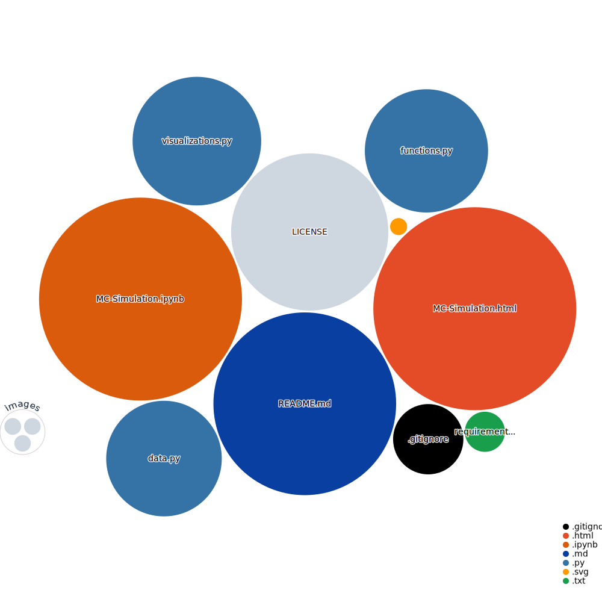

### **MonteCarlo Simulation**   

 <i>Tools:</i> 

  
##### Actions:  
##### Main Text-Editor:    
##### Language:  
##### Libraries:        
##### Venv:  
##### Interface:  
##### Version Control:    

##### License: 

 
 <i> Repo Visualization: </i> 

 
  

 
 

 <i>Contact:</i> 

  
   

 

---

<b>Description:</b> 

[LaTeX gh-app](https://github.com/EstebanMqz/MonteCarlo-Simulation/blob/main/images/Description.jpg)

This repository illustrates how MonteCarlo calculates crucial decision-making tools from simulations $X \sim f(X)$ like [E[X]](README.md#references):

$$E[X] \approx \frac{1}{N} \sum_{i=1}^{N} x_i = \mu_{M.C}$$

$X$ = <i>Random Variable from simulations.</i>  
$\mu_{M.C}$ = <i>Mean of the MonteCarlo Simulations.</i> 
$N$ = <i>No° of Simulations.</i>

& [E[RoI]](README.md#references) and probabilities with their density function [f(X)](README.md#references) & <i>cumulative distribution</i> [F(X)](README.md#references):

In this case the expected Capital per game in $(n=100)$ games planned to be played in a <i>Casi-no</i> is:

$$E[X_1]+ E[X_2] + ... + E[X_n] = \mu_{MC{_{1,2,...n}}}$$

 
 <b>  Results: </b> 

  
The Expectancy of the Capital could have the following outcomes for $E[X_{1,2,.., n}]$: 

|           |1           |2           |3           |4           |5          |6           |7           |8           |9           |10         |11      |12           |13           |14           |15           |16          |17          |18          |19          |20          |21          |22          |23          |24         |25          |26          |27          |28          |29         |30      |31           |32           |33           |34           |35          |36          |37          |38          |39          |40          |41          |42          |43         |44          |45          |46          |47          |48         |49      |50           |51           |52           |53           |54          |55          |56          |57          |58          |59          |60          |61          |62         |63          |64          |65          |66          |67         |68      |69           |70           |71           |72           |73          |74          |75          |76          |77          |78          |79          |80          |81         |82          |83          |84          |85          |86         |87      |88           |89           |90           |91           |92          |93          |94          |95          |96          |97          |98          |99          |100         |
|---:|------:|------:|------:|---------:|---------:|----------:|----------:|----------:|----------:|----------:|----------:|----------:|----------:|----------:|----------:|---------:|---------:|---------:|---------:|---------:|---------:|----------:|----------:|----------:|----------:|----------:|----------:|----------:|----------:|----------:|----------:|----------:|----------:|---------:|---------:|----------:|----------:|---------:|---------:|----------:|----------:|----------:|----------:|----------:|----------:|----------:|----------:|----------:|----------:|---------:|---------:|----------:|----------:|----------:|----------:|----------:|----------:|----------:|----------:|----------:|----------:|----------:|----------:|----------:|----------:|----------:|----------:|----------:|----------:|----------:|----------:|---------:|---------:|----------:|----------:|----------:|----------:|----------:|----------:|----------:|----------:|---------:|---------:|---------:|---------:|----------:|----------:|----------:|----------:|---------:|---------:|----------:|----------:|---------:|---------:|---------:|---------:|----------:|-----------:|-----------:|
|$E[X]$| 50 | 49    | 48    | 47    | 48.286   | 47.286   | 47.9132   | 46.9132   | 47.7366   | 46.7366   | 47.5672   | 46.5672   | 47.3213   | 46.3213   | 47.1186   | 46.1186   | 46.8925  | 45.8925  | 46.7285  | 45.7285  | 46.5285  | 45.5285  | 46.2754   | 45.2754   | 46.0646   | 45.0646   | 45.8826   | 44.8826   | 45.6961   | 44.6961   | 45.5798   | 44.5798   | 45.3564   | 44.3564   | 45.1555  | 44.1555  | 44.9609   | 43.9609   | 44.751   | 43.751   | 44.5789   | 43.5789   | 44.3744   | 43.3744   | 44.1681   | 43.1681   | 43.8997   | 42.8997   | 43.7483   | 42.7483   | 43.5285  | 42.5285  | 43.3519   | 42.3519   | 43.2113   | 42.2113   | 42.9933   | 41.9933   | 42.8149   | 41.8149   | 42.5978   | 41.5978   | 42.4176   | 41.4176   | 42.1798   | 41.1798   | 42.0077   | 41.0077   | 41.8041   | 40.8041   | 41.6041   | 40.6041   | 41.4005  | 40.4005  | 41.2023   | 40.2023   | 41.0032   | 40.0032   | 40.7933   | 39.7933   | 40.5699   | 39.5699   | 40.378   | 39.378   | 40.1195  | 39.1195  | 39.9519   | 38.9519   | 39.7762   | 38.7762   | 39.524   | 38.524   | 39.2979   | 38.2979   | 39.061   | 38.061   | 38.8745  | 37.8745  | 38.6664   |  37.6664   |
|$E[RoI]$|  0 | -0.02 | -0.04 | -0.06 | -0.03428 | -0.05428 | -0.041736 | -0.061736 | -0.045268 | -0.065268 | -0.048656 | -0.068656 | -0.053574 | -0.073574 | -0.057628 | -0.077628 | -0.06215 | -0.08215 | -0.06543 | -0.08543 | -0.06943 | -0.08943 | -0.074492 | -0.094492 | -0.078708 | -0.098708 | -0.082348 | -0.102348 | -0.086078 | -0.106078 | -0.088404 | -0.108404 | -0.092872 | -0.112872 | -0.09689 | -0.11689 | -0.100782 | -0.120782 | -0.10498 | -0.12498 | -0.108422 | -0.128422 | -0.112512 | -0.132512 | -0.116638 | -0.136638 | -0.122006 | -0.142006 | -0.125034 | -0.145034 | -0.12943 | -0.14943 | -0.132962 | -0.152962 | -0.135774 | -0.155774 | -0.140134 | -0.160134 | -0.143702 | -0.163702 | -0.148044 | -0.168044 | -0.151648 | -0.171648 | -0.156404 | -0.176404 | -0.159846 | -0.179846 | -0.163918 | -0.183918 | -0.167918 | -0.187918 | -0.17199 | -0.19199 | -0.175954 | -0.195954 | -0.179936 | -0.199936 | -0.184134 | -0.204134 | -0.188602 | -0.208602 | -0.19244 | -0.21244 | -0.19761 | -0.21761 | -0.200962 | -0.220962 | -0.204476 | -0.224476 | -0.20952 | -0.22952 | -0.214042 | -0.234042 | -0.21878 | -0.23878 | -0.22251 | -0.24251 | -0.226672 |  -0.246672 |

At the $100_{th}$ game the probability to Win is:

|        | $Pr(E[X_n] \geq \$50)$ |
|--------|-----------------------|
| True   | 0.1944                |
| False  | 0.8056                |

 

Probabilities are illustrated with their frequencies:

| $x_n$ | frequency | $f(x)$ | $F(x)$ |
|-----|-----------|------|------|
| -31 | 3         | 0.0003 | 0.0003 |
| -22 | 16        | 0.0016 | 0.0019 |
| -13 | 54        | 0.0054 | 0.0073 |
| -4  | 189       | 0.0189 | 0.0262 |
| 5   | 435       | 0.0435 | 0.0697 |
| 14  | 914       | 0.0914 | 0.1611 |
| 23  | 1422      | 0.1422 | 0.3033 |
| 32  | 1714      | 0.1714 | 0.4747 |
| 41  | 1846      | 0.1846 | 0.6593 |
| 50  | 1463      | 0.1463 | 0.8056 |
| 59  | 1021      | 0.1021 | 0.9077 |
| 68  | 576       | 0.0576 | 0.9653 |
| 77  | 227       | 0.0227 | 0.988  |
| 86  | 91        | 0.0091 | 0.9971 |
| 95  | 22        | 0.0022 | 0.9993 |
| 104 | 6         | 0.0006 | 0.9999 |
| 113 | 1         | 0.0001 | 1      |

 

Resulting $f(X)$ on the Winning Games in a $100_{th}$ played & the $\mu_{MC{_{1,2,...n}}}$ should be the same as $X$ is discrete for both games and Capital: 

 

<b>Note:</b> $n_{\Delta}$ $\approx$ $\xi$ for each simulation $\mu_{MC{_{n_1,n_2,..}}}$  
<i>See [Repo Visualization](#Repo-Visualization) render for more details.</i> 

 

###### Reusable: [vs.MC_plot](https://github.com/EstebanMqz/MonteCarlo-Simulation/blob/main/visualizations.py), [fn.docstring](https://github.com/EstebanMqz/MonteCarlo-Simulation/blob/main/functions.py), [fn.tab_md](https://github.com/EstebanMqz/MonteCarlo-Simulation/blob/main/functions.py), [fn.README_md](https://github.com/EstebanMqz/MonteCarlo-Simulation/blob/main/functions.py), [dt.get_requirements](https://github.com/EstebanMqz/MonteCarlo-Simulation/blob/main/data.py), [dt.write_docstring](https://github.com/EstebanMqz/MonteCarlo-Simulation/blob/main/data.py), [dt.frequencies](https://github.com/EstebanMqz/MonteCarlo-Simulation/blob/main/data.py)
###### References:  

+ [Monte Simulations](http://www.mit.edu/~kircher/sim.pdf) 
+ [E[X]](https://en.wikipedia.org/wiki/Expected_value) ➡️ [RoI](https://en.wikipedia.org/wiki/Rate_of_return) 
+ [f(X) mass function](https://en.wikipedia.org/wiki/Probability_mass_function) ↔ [F(X)](https://en.wikipedia.org/wiki/Cumulative_distribution_function) 
+ [`random.randrange`](https://docs.python.org/3/library/random.html#random.randrange) 
+ [LaTeX](https://en.wikipedia.org/wiki/List_of_mathematical_symbols_by_subject) 
